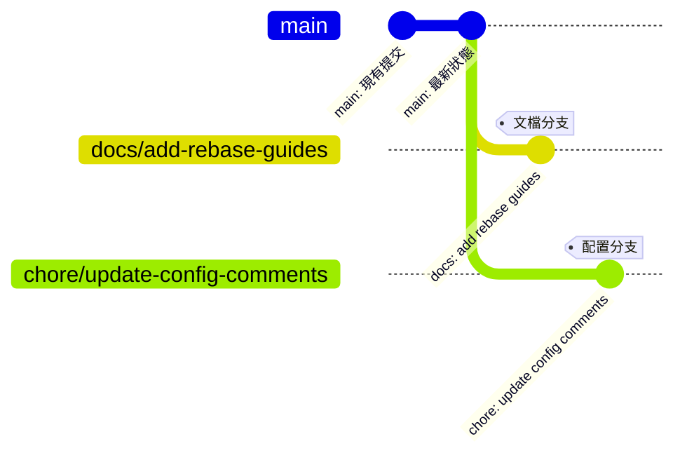
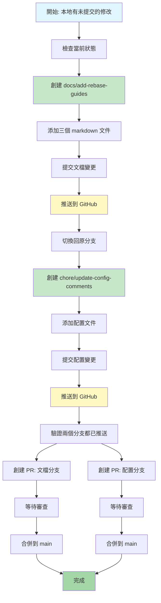
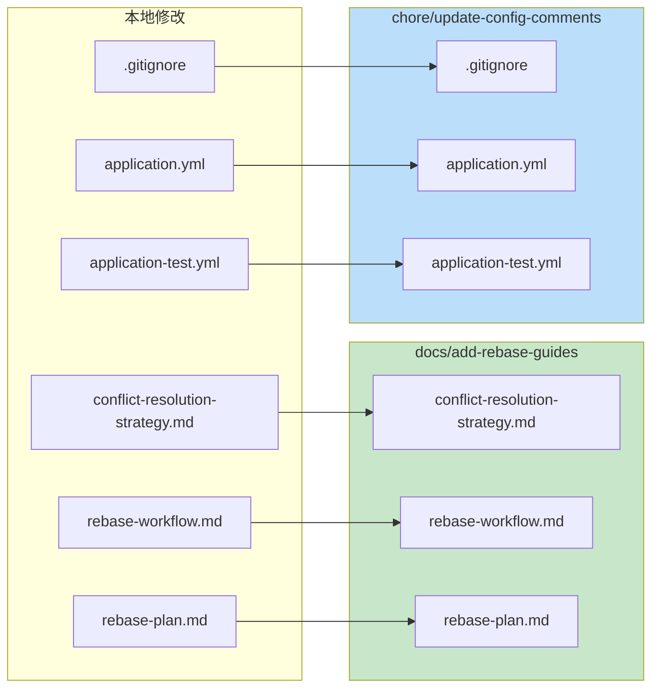
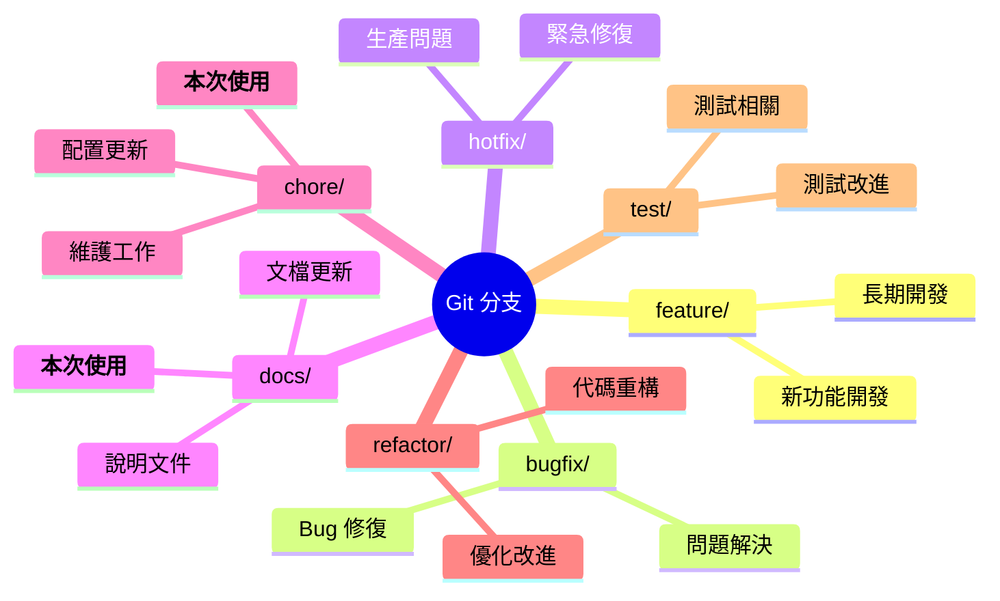
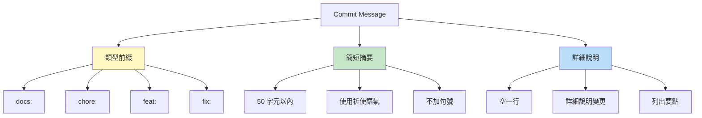
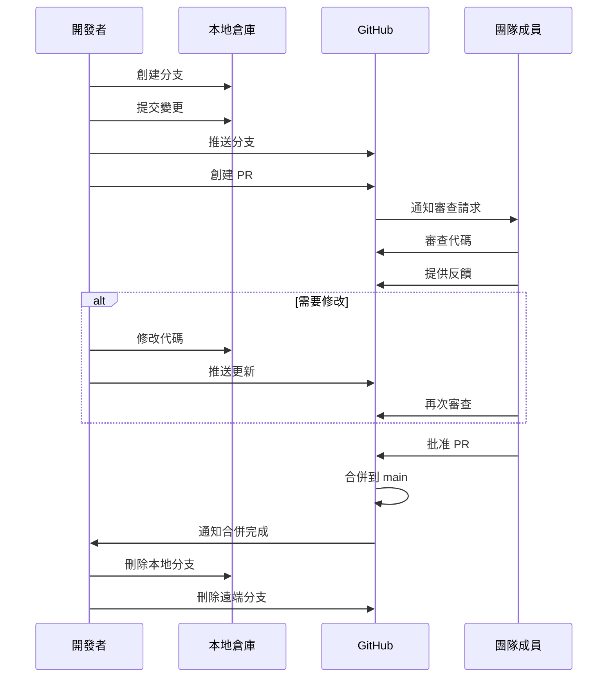
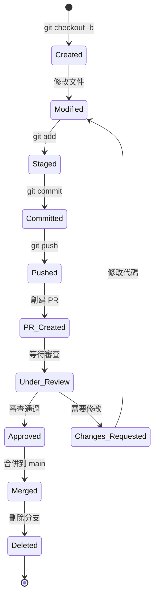
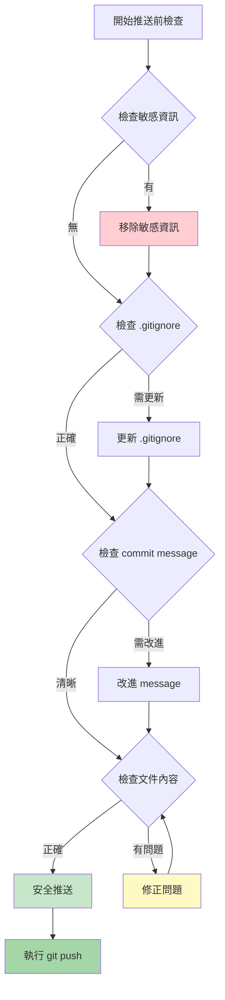

# Git 分支策略視覺化

## 📊 分支結構圖

---

## 🔄 執行流程圖

---

## 📁 文件分配圖

---

## 🎯 分支命名策略

---

## 📝 Commit Message 結構

---

## 🔄 Pull Request 流程

---

## 🎨 分支生命週期

---

## 📊 時間線估算

```mermaid
gantt
    title Git 分支推送時間線
    dateFormat HH:mm
    axisFormat %H:%M
    
    section 準備階段
    檢查狀態           :00:00, 5m
    
    section 文檔分支
    創建分支           :00:05, 1m
    添加文件           :00:06, 2m
    提交變更           :00:08, 2m
    推送到 GitHub      :00:10, 3m
    
    section 配置分支
    切換分支           :00:13, 1m
    創建新分支         :00:14, 1m
    添加文件           :00:15, 2m
    提交變更           :00:17, 2m
    推送到 GitHub      :00:19, 3m
    
    section 後續工作
    驗證推送           :00:22, 3m
    創建 PR (文檔)     :00:25, 5m
    創建 PR (配置)     :00:30, 5m
```

---

## 🛡️ 安全檢查清單

---

## 💡 最佳實踐提醒

### ✅ 應該做的

- 使用描述性的分支名稱
- 寫清晰的 commit message
- 推送前檢查暫存的文件
- 為每個 PR 提供詳細說明
- 定期同步主分支

### ❌ 不應該做的

- 在分支中混合不相關的變更
- 使用模糊的 commit message
- 推送未測試的代碼
- 忽略 code review 反饋
- 直接推送到 main 分支

---

## 🔗 相關文檔

- 詳細執行計劃：[`git-branch-push-plan.md`](git-branch-push-plan.md)
- 快速參考指南：[`git-branch-push-quick-guide.md`](git-branch-push-quick-guide.md)
- Rebase 工作流程：[`rebase-workflow.md`](rebase-workflow.md)
- 衝突解決策略：[`conflict-resolution-strategy.md`](conflict-resolution-strategy.md)

---

**準備好開始了嗎？參考快速指南開始執行！** 🚀