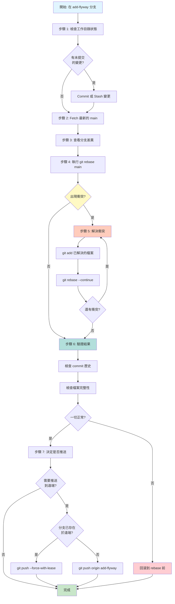
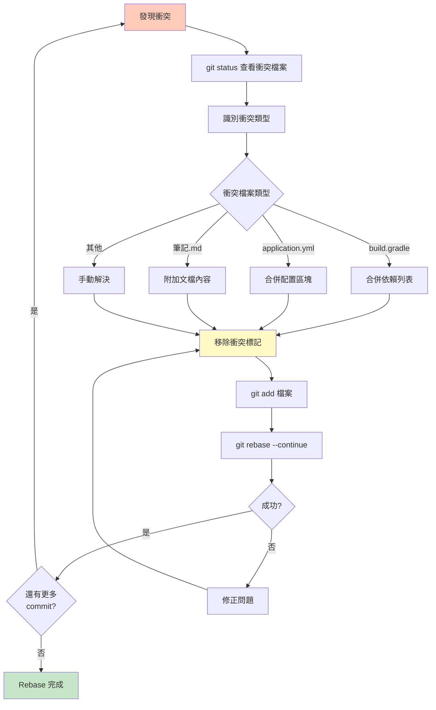
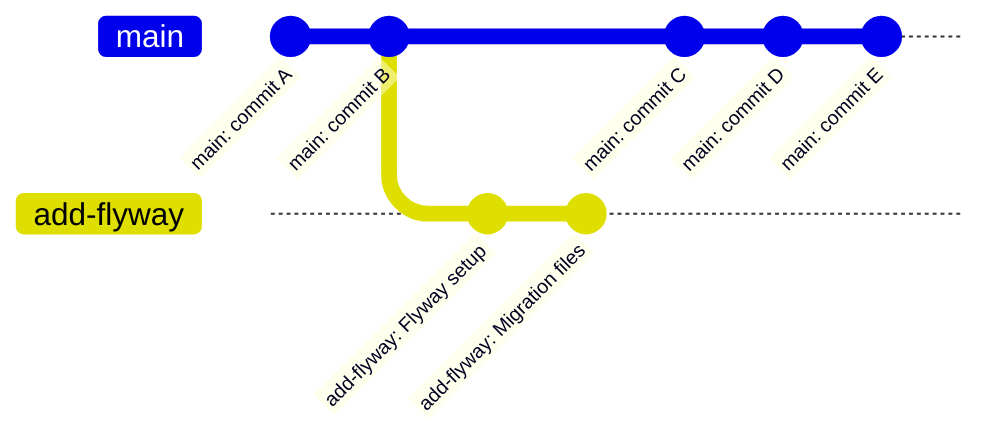
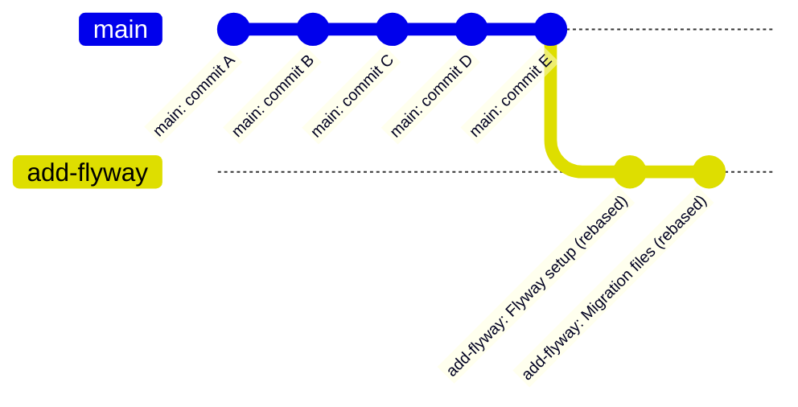
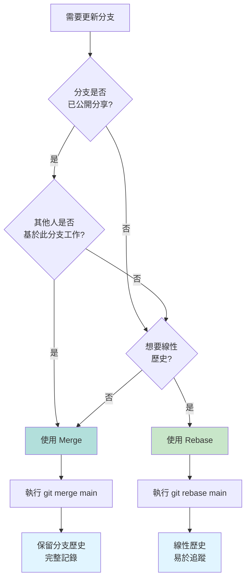
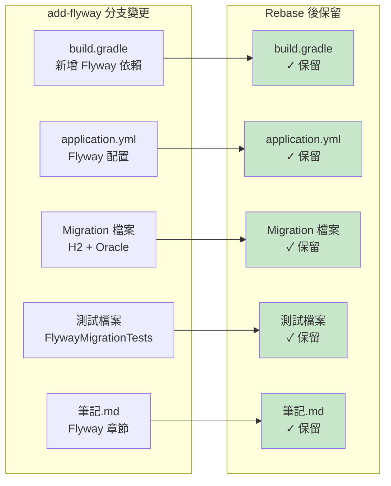
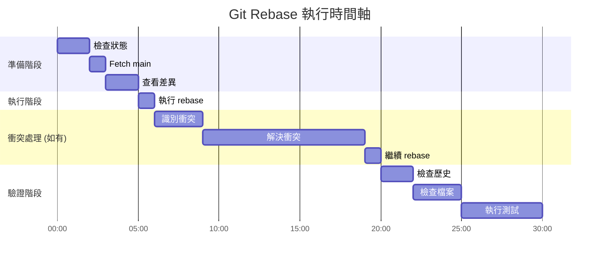
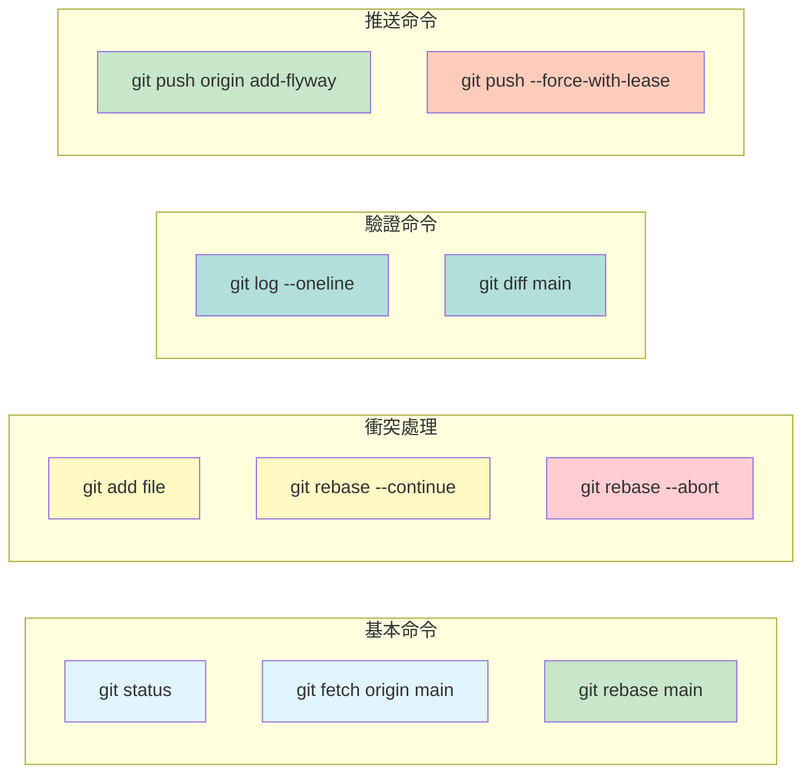

# Git Rebase 工作流程圖

## 整體流程

```mermaid
flowchart TD
    Start[開始: 在 add-flyway 分支] --> CheckStatus[步驟 1: 檢查工作目錄狀態]
    CheckStatus --> HasChanges{有未提交<br/>的變更?}
    
    HasChanges -->|是| CommitOrStash[Commit 或 Stash 變更]
    HasChanges -->|否| FetchMain[步驟 2: Fetch 最新的 main]
    CommitOrStash --> FetchMain
    
    FetchMain --> ViewDiff[步驟 3: 查看分支差異]
    ViewDiff --> Rebase[步驟 4: 執行 git rebase main]
    
    Rebase --> HasConflict{出現衝突?}
    
    HasConflict -->|否| VerifySuccess[步驟 6: 驗證結果]
    HasConflict -->|是| ResolveConflict[步驟 5: 解決衝突]
    
    ResolveConflict --> AddResolved[git add 已解決的檔案]
    AddResolved --> ContinueRebase[git rebase --continue]
    ContinueRebase --> MoreConflicts{還有衝突?}
    
    MoreConflicts -->|是| ResolveConflict
    MoreConflicts -->|否| VerifySuccess
    
    VerifySuccess --> CheckHistory[檢查 commit 歷史]
    CheckHistory --> CheckFiles[檢查檔案完整性]
    CheckFiles --> AllGood{一切正常?}
    
    AllGood -->|是| PushDecision[步驟 7: 決定是否推送]
    AllGood -->|否| Rollback[回滾到 rebase 前]
    
    PushDecision --> NeedPush{需要推送<br/>到遠端?}
    NeedPush -->|是| AlreadyPushed{分支已存在<br/>於遠端?}
    NeedPush -->|否| Done[完成]
    
    AlreadyPushed -->|是| ForcePush[git push --force-with-lease]
    AlreadyPushed -->|否| NormalPush[git push origin add-flyway]
    
    ForcePush --> Done
    NormalPush --> Done
    Rollback --> Done
    
    style Start fill:#e1f5ff
    style Done fill:#c8e6c9
    style HasConflict fill:#fff9c4
    style ResolveConflict fill:#ffccbc
    style VerifySuccess fill:#b2dfdb
    style Rollback fill:#ffcdd2
```

## 衝突解決流程

```mermaid
flowchart TD
    Conflict[發現衝突] --> Status[git status 查看衝突檔案]
    Status --> Identify[識別衝突類型]
    
    Identify --> FileType{衝突檔案類型}
    
    FileType -->|build.gradle| GradleConflict[合併依賴列表]
    FileType -->|application.yml| YamlConflict[合併配置區塊]
    FileType -->|筆記.md| DocConflict[附加文檔內容]
    FileType -->|其他| ManualResolve[手動解決]
    
    GradleConflict --> RemoveMarkers[移除衝突標記]
    YamlConflict --> RemoveMarkers
    DocConflict --> RemoveMarkers
    ManualResolve --> RemoveMarkers
    
    RemoveMarkers --> GitAdd[git add 檔案]
    GitAdd --> Continue[git rebase --continue]
    
    Continue --> Success{成功?}
    Success -->|是| NextCommit{還有更多<br/>commit?}
    Success -->|否| FixAgain[修正問題]
    
    NextCommit -->|是| Conflict
    NextCommit -->|否| Complete[Rebase 完成]
    
    FixAgain --> RemoveMarkers
    
    style Conflict fill:#ffccbc
    style Complete fill:#c8e6c9
    style RemoveMarkers fill:#fff9c4
```

## 分支狀態變化

```mermaid
gitGraph
    commit id: "main: commit A"
    commit id: "main: commit B"
    branch add-flyway
    commit id: "add-flyway: Flyway setup"
    commit id: "add-flyway: Migration files"
    checkout main
    commit id: "main: commit C"
    commit id: "main: commit D"
    commit id: "main: commit E"
```

### Rebase 後

```mermaid
gitGraph
    commit id: "main: commit A"
    commit id: "main: commit B"
    commit id: "main: commit C"
    commit id: "main: commit D"
    commit id: "main: commit E"
    branch add-flyway
    commit id: "add-flyway: Flyway setup (rebased)"
    commit id: "add-flyway: Migration files (rebased)"
```

## 決策樹：選擇 Rebase 或 Merge

```mermaid
flowchart TD
    Start[需要更新分支] --> Question1{分支是否<br/>已公開分享?}
    
    Question1 -->|是| Question2{其他人是否<br/>基於此分支工作?}
    Question1 -->|否| Question3{想要線性<br/>歷史?}
    
    Question2 -->|是| UseMerge[使用 Merge]
    Question2 -->|否| Question3
    
    Question3 -->|是| UseRebase[使用 Rebase]
    Question3 -->|否| UseMerge
    
    UseRebase --> RebaseFlow[執行 git rebase main]
    UseMerge --> MergeFlow[執行 git merge main]
    
    RebaseFlow --> LinearHistory[線性歷史<br/>易於追蹤]
    MergeFlow --> BranchHistory[保留分支歷史<br/>完整記錄]
    
    style UseRebase fill:#c8e6c9
    style UseMerge fill:#b2dfdb
    style LinearHistory fill:#e1f5ff
    style BranchHistory fill:#e1f5ff
```

## 檔案變更追蹤

```mermaid
flowchart LR
    subgraph "add-flyway 分支變更"
        A1[build.gradle<br/>新增 Flyway 依賴]
        A2[application.yml<br/>Flyway 配置]
        A3[Migration 檔案<br/>H2 + Oracle]
        A4[測試檔案<br/>FlywayMigrationTests]
        A5[筆記.md<br/>Flyway 章節]
    end
    
    subgraph "Rebase 後保留"
        B1[build.gradle<br/>✓ 保留]
        B2[application.yml<br/>✓ 保留]
        B3[Migration 檔案<br/>✓ 保留]
        B4[測試檔案<br/>✓ 保留]
        B5[筆記.md<br/>✓ 保留]
    end
    
    A1 --> B1
    A2 --> B2
    A3 --> B3
    A4 --> B4
    A5 --> B5
    
    style B1 fill:#c8e6c9
    style B2 fill:#c8e6c9
    style B3 fill:#c8e6c9
    style B4 fill:#c8e6c9
    style B5 fill:#c8e6c9
```

## 時間軸估算

```mermaid
gantt
    title Git Rebase 執行時間軸
    dateFormat mm:ss
    axisFormat %M:%S
    
    section 準備階段
    檢查狀態           :00:00, 2m
    Fetch main        :02:00, 1m
    查看差異           :03:00, 2m
    
    section 執行階段
    執行 rebase       :05:00, 1m
    
    section 衝突處理 (如有)
    識別衝突           :06:00, 3m
    解決衝突           :09:00, 10m
    繼續 rebase       :19:00, 1m
    
    section 驗證階段
    檢查歷史           :20:00, 2m
    檢查檔案           :22:00, 3m
    執行測試           :25:00, 5m
```

## 關鍵命令速查

```mermaid
flowchart LR
    subgraph "基本命令"
        C1[git status]
        C2[git fetch origin main]
        C3[git rebase main]
    end
    
    subgraph "衝突處理"
        C4[git add file]
        C5[git rebase --continue]
        C6[git rebase --abort]
    end
    
    subgraph "驗證命令"
        C7[git log --oneline]
        C8[git diff main]
    end
    
    subgraph "推送命令"
        C9[git push origin add-flyway]
        C10[git push --force-with-lease]
    end
    
    style C1 fill:#e1f5ff
    style C2 fill:#e1f5ff
    style C3 fill:#c8e6c9
    style C4 fill:#fff9c4
    style C5 fill:#fff9c4
    style C6 fill:#ffcdd2
    style C7 fill:#b2dfdb
    style C8 fill:#b2dfdb
    style C9 fill:#c8e6c9
    style C10 fill:#ffccbc
```
